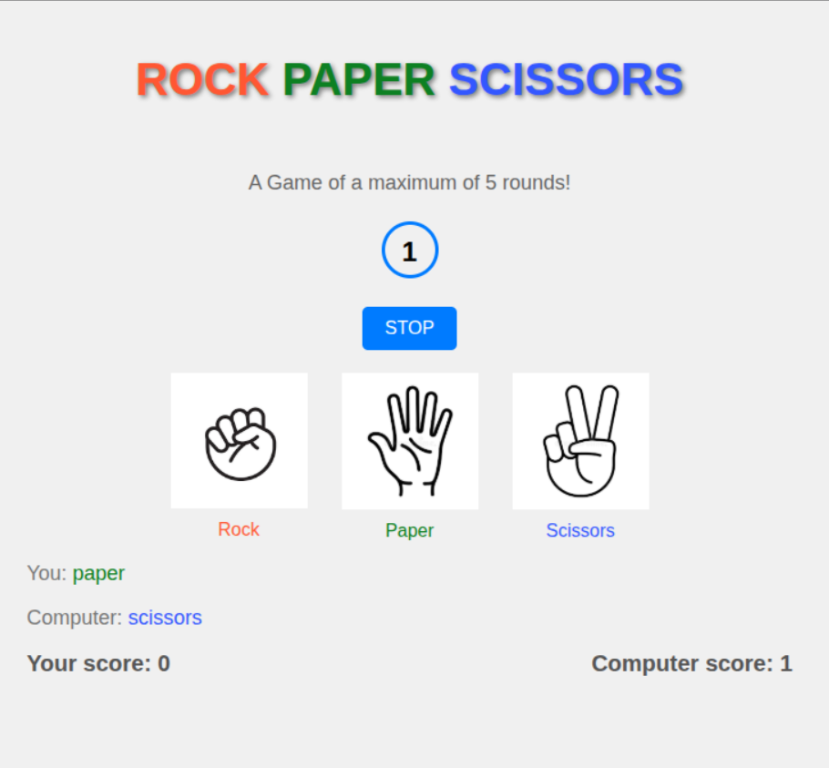

# PAPER, ROCK, SCISSORS

> _Click on the image above to play!_

## Description
This game is a minimal emulation the traditional (hand to hand) rock-paper-scissors game.

It is played between the computer and the user. The computer will randomly make the choices and so the user is also expected to make guesses on how to beat the computer

The game is just of a maximum of 5 rounds. If the left rounds left to play can not enable the player with few scores to make a win, the game will end before all the 5 rounds being played and the player with more scores will become the winner. ie if the computer has 3 scores and the user has 1 score yet 1 round is left, the computer will be made the winner.

## References
- [How to Play Rock, Paper, Scissors: A Simple Guide](https://www.wikihow.com/Play-Rock,-Paper,-Scissors)
